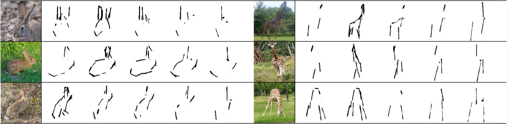

# Emergent Graphical Conventions in a Visual Communication Game
For details, see [[arXiv](https://arxiv.org/abs/2111.14210)][[Website](https://sites.google.com/view/emergent-graphical-conventions)]
<div align="center">
  
</div>

## Environment setup
```
numpy
torch==1.11.0
opencv-python
argparse
torchvision
wandb
tqdm
```
## dataset and pretrained model
The pixel-level sketch is generated by [Synthesizing human-like sketches from natural images](https://github.com/kampelmuehler/synthesizing_human_like_sketches)

Sender is pretrained with [ICCV2019-Learning to Paint](https://github.com/megvii-research/ICCV2019-LearningToPaint). The color output is reset to all ones.

The generated data and pretrained model are saved at 
https://drive.google.com/drive/folders/1bhLefcXMllR8vf_Uz3aOb0OSGxZKM3RI?usp=sharing

put data under `data` folder, put pretrained models under `pretrained` folder

## Training
complete setting
```
python train_dreamer_add_class_gen.py --batch_size=64 --max_step=7 --game_size=4 --outf='./output_comp_rs0/' --exp='comp_rs0' --log_outf='train_log' --validate_episode=10 --discount=0.85 --sender_path='pretrained/actor.pkl' --num_stroke=5 --category_list='data/category.txt' --n_games=50000 --split_root='data/same_cate_mul_image300' --sender_decay=0.99 --manualSeed=0 --setting complete --data_root 'data/output/'
```
max setting
```
python train_dreamer_add_class_gen.py --batch_size=64 --max_step=7 --game_size=4 --outf='./output_max_rs0/' --exp='max_rs0' --log_outf='train_log' --validate_episode=10 --discount=0.85 --sender_path='pretrained/actor.pkl' --num_stroke=5 --category_list='data/category.txt' --n_games=50000 --split_root='data/same_cate_mul_image300' --sender_decay=0.99 --manualSeed=0 --setting max --data_root='data/output/'
```
sender-fixed setting
```
python train_dreamer_add_class_gen.py --batch_size=64 --max_step=7 --game_size=4 --outf='./output_sender_fix_rs0/' --exp='sender_fix_rs0' --log_outf='train_log' --validate_episode=10 --discount=0.85 --sender_path='pretrained/actor.pkl' --num_stroke=5 --category_list='data/category.txt' --n_games=50000 --split_root='data/same_cate_mul_image300' --sender_decay=0.99 --manualSeed=0 --setting sender_fix --data_root='data/output/' --sender_fixed 1
```
one-step setting
```
python train_dreamer_add_class_gen.py --batch_size=64 --max_step=1 --game_size=4 --outf='./output_one_step_rs0/' --exp='one_step_rs0' --log_outf='train_log' --validate_episode=10 --discount=0.85 --sender_path='pretrained/actor.pkl' --num_stroke=5 --category_list='data/category.txt' --n_games=50000 --split_root='data/same_cate_mul_image300' --sender_decay=0.99 --manualSeed=0 --setting one_step --data_root='data/output/'
```
retrieve
```
python train_original_reward_retrieve_5stroke_accum.py --batch_size=64 --max_step=7 --game_size=4 --outf='./output_retrieve_rs0/' --exp='retrieve_rs0' --log_outf='train_log' --validate_episode=10 --discount=0.85 --sender_path='pretrained/actor.pkl' --num_stroke=5 --category_list='data/category.txt' --n_games=50000 --split_root='data/same_cate_mul_image300' --sender_decay=0.99 --manualSeed=0 --setting retrieve --data_root='data/output/' --sender_fixed 1
```
accumulative reward
```
python train_original_reward_retrieve_5stroke_accum.py --batch_size=64 --max_step=7 --game_size=4 --outf='./output_cum_rs0/' --exp='cum_rs0' --log_outf='train_log' --validate_episode=10 --discount=0.85 --sender_path='pretrained/actor.pkl' --num_stroke=5 --category_list='data/category.txt' --n_games=50000 --split_root='data/same_cate_mul_image300' --sender_decay=0.99 --manualSeed=0 --setting cum --data_root='data/output/'
```
## Evaluation
model test for generalization, classification and semantic correlation

Test data pairs are generated by `data_preprocessing.py`.

Example to evaluate complete setting
```
python train_dreamer_add_class_gen.py --batch_size=64 --max_step=7 --game_size=4 --outf='./output_comp_rs0/' --exp='comp_rs0' --log_outf='train_log' --validate_episode=10 --discount=0.85 --sender_path='pretrained/actor.pkl' --num_stroke=5 --category_list='data/category.txt' --n_games=50000 --split_root='data/same_cate_mul_image300' --sender_decay=0.99 --manualSeed=0 --setting complete --data_root 'data/output/' --resume_path 'ckpt/comp_rs0.pt' --offline_test 1
```